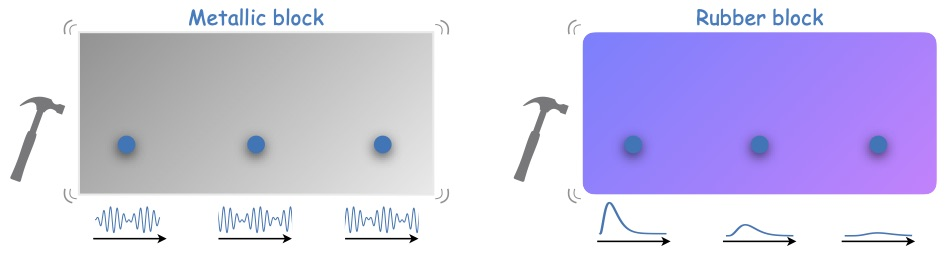
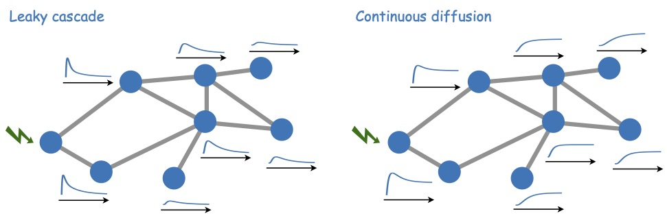

> WARNING: REPOSITORY UNDER CONSTRUCTION !! First complete release expected during May 2024, stay tuned ! Or follow @GZamora_Lopez in Twitter.

&nbsp;
## 1. What is Stimulus-Response Network Analysis?

Graph theory constitutes a widely used and established field providing powerful tools for the characterization of networks. However, the diversity of complex networks studied nowadays overcomes the capabilities of graph theory to understand networks and their function, since it was originally developed from a combinatorial and probabilistic point of view, for binary graphs. 

*Stimulus-Response Network Analysis* (SRNA) is a paradigm shift in the way we study complex networks and interpret their results: from a (combinatorial) data-driven tradition to a (dynamical) model-based data analysis perspective. In the recent years plenty of alternative metrics have been proposed which are–one way or another–based on dynamical phenomena happening on networks. However, for many of these metrics the underlying dynamical model and its assumptions are hidden, or not openly acknowledged. To make things more confusing, network metrics are usually presented with a sense of universality, "*as if*" they were useful and interpretable in any network despite their specific underlying (dynamical) assumptions.
The goal of SRNA is to take full advantage of model-based network analyses with transparency at the front. To encompass existing metrics into an integrated methodology and to provide network analysis tools in which the underlying assumptions are recognized from the beginning, thus favouring the interpretability of results.

The core idea is to reveal the properties of networks by probing how the nodes of a network respond to small, localised perturbations (e.g., a stimulus of unit amplitude). Imagine a rectangular brick made of some material. Imagine we tap the brick at one of its sides with a small hammer and measure the resulting responses (e.g., vibrations or displacement) at different sites of the brick, Fig. 1. The manner in which the "kick" propagates throughout the brick–and consequently the responses observed–depends on the material the brick is made of. A wooden rod will tend to show a displacement, a metallic brick may start vibrating and a brick made of soft rubber will attenuate the propagation of the perturbation. By carefully studying the responses at differnt sites, we can derive the properties of the brick and its internal composition.

**Figure–1:** Physical analogy to *Stimulus-Response Network Analysis* in the form of a brick. The response of the brick to a tapping depends on the material the brick is made of. A metallic brick may start vibrating (which we may eventually hear) but in a brick of soft rubber the propagation of the perturbation is likely to be absorved and barely be noticed at the other side.   
&nbsp;

Analogously, *SRNA* aims at investigating the properties of a network by applying a stimulus in one node and observing how the rest of the nodes respond, as illustrated in Fig. 2. In our case, the dynamical propagation model of choice is like the material of which the brick is made of, since it is this model which determines how the stimulus propagates along the network. In *RSNA* the canonical propagation model is repleceable, thus allowing to investigate the properties of one network as if it were "made of different materials." 

**Figure–2:** Schematic representation of *Stimulus-Response Network Analysis* as a methodology. The idea is to investigate the properties of networks by observing how nodes respond to a small perturbation (stimulus) applied locally to one node, which can be done for a variety of canonical propagation models governing how the stimulus propagates.
&nbsp;

&nbsp;
### Working pipeline in Stimulus-Response Network Analysis

Getting the analysis started under SRNA might be a little less straight forward than with traditional graph theory since, in this case, the analyses are tuned for a class of dynamics (propagation model). On the positive side, it implies that we become aware of basic assumptions, contraints and limitations from the beginning. Here, a general overview of the generalised  procedure envisioned:

1. **Identify the key constraints** of the real system investigated. For example, the user may need to question whether the networked system is discrete or continuous, whether it is conservative or non-conservative, whether it follows divergent or convergent behavior, whether it is diffusively coupled or not.
2. **Choose a canonical propagation propagation model** that satisfies those assumptions and constraints. We propose initially five linear canonical models of propagation and diffusion, but users may consider other canonical models if required by the nature of the real system.
3. **Compute the pair-wise network responses** $\mathcal{R}(t)$ of the network, for the chosen canonical model. The elements $\mathcal{R}_{ij}(t)$ are the temporal evolution of the responses of node $i$ to a stimulus applied at node $j$ at time $t=0$. It is usually calculated as the *propagator* (for time-continuous systems) or the *Green's function* (for time-continuous cases) of the propagation dynamics on a network.
4. Extract information out of $\mathcal{R}(t)$ in the form of **spatio-temporal network metrics**. For example, the global network response $r(t)$, the time-to-peak distance $D^{ttp}$ and the in-/out-responses $r_i(t)$ of the nodes.

Steps #3 and #4 are an attempt to unify the analysis tools, regardless of the canonical model. However, this may not imply that all possible metrics are  meaningful or computable for all the models. 

&nbsp;
### What to do next

TODO: Revise these lists and the links.

Read more …

- *[Docs\_2\_Canonical_Models](Docs_2_Canonical_Models.md)* : Description of simple (canonical) models for various classes of dynamical propagation on networks, following a variety of assumptions and constraints. 
- *[Docs\_3\_xxxxxxxxx](#)* : Short description follows …

Or start playing around with SiReNetA using [https://github.com/mb-BCA/SiReNetA_Tutorials](tutorials):

1. *[Getting Started and Overview](Tutorial_Notebooks/1_GettingStarted.ipynb)* : A quick overview of what Stimulus-Response Network Analysis is. Use the sample graph with 8 nodes.
2. *[Calculating Response to Stimulus and Metrics](Tutorial_Notebooks/2_Basics_StimRespMetrics.ipynb)* : Fundamentals of Stimulus-Response Network Analysis. Undertanding the stimulus-responses at all levels (pairs-wise, node-wise and network level).
3. *[Canonical Models](Tutorial_Notebooks/3_Basics_CanonModels.ipynb)* : An overview of the different canonical models.
4. Also check the different usecases for practical applications of the analysis framework.

#